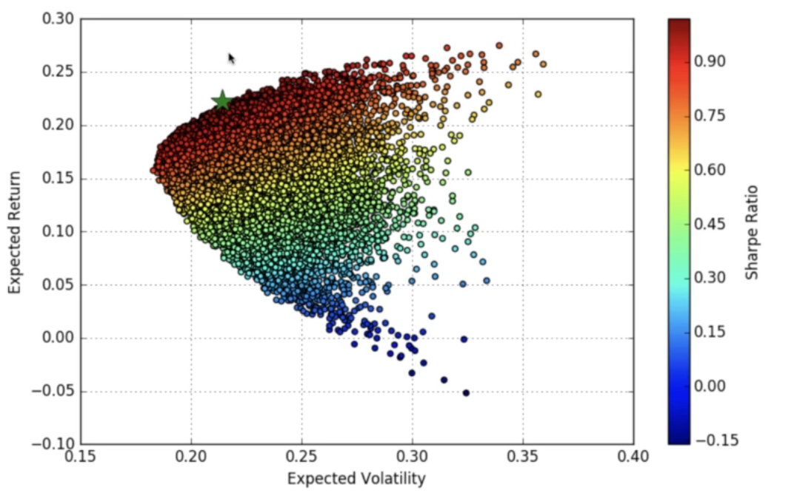
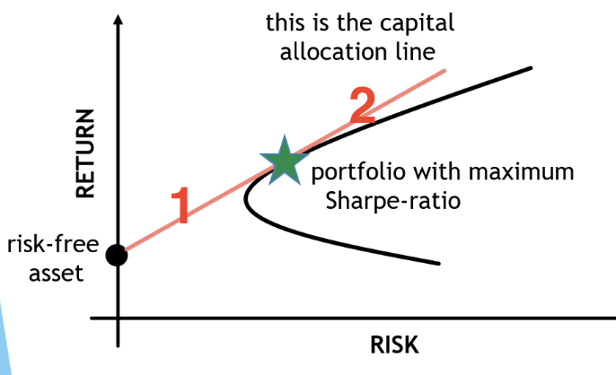
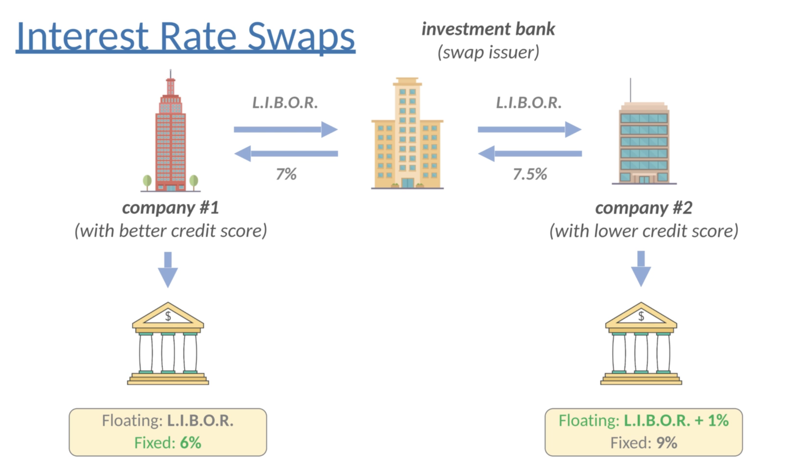
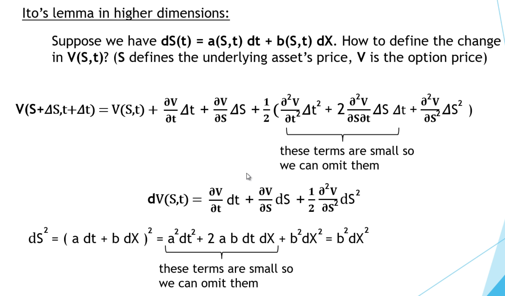
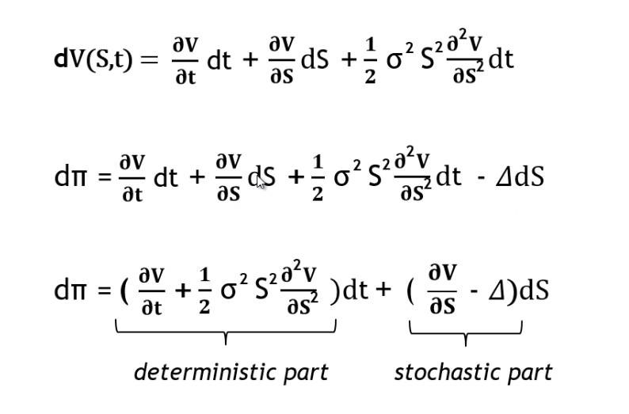

# Preface

My initial of learning this course is to strengthen my background/understanding in financial products and financial engineering. By learning those techniques and getting some hands-on experience, I believe I would be able to do more advanced/important jobs and make more contributions to this society (also get more compensation :D ).

# Summary of Contents

- Stock Market Basics
- Bonds Theory
- Bonds Implementation
- Modern Portfolio Theory (Markowitz-Model)
- Markowitz-Model Implementation
- CAPM Theory
- CAPM Implementation
- Derivatives Basics
- Random Behavior in Finance
- Black-Scholes Model
- Black-Scholes Model Implementation
- VaR
- CDOs (Collateralized Debt Obligations) and the Financial Crisis
- Interest Rate Modelling (Vasicek Model)
- Pricing Bonds with Vasicek Model
- Long-Term Investing 

# Stock Market Basics

## Time value of Money

Present value (PV)  VS  Future value (FV)

$$FV= PV * (1+r)^n$$

With continuous models, we have differential equations:
$$x(t+dt) - x(t) = \frac{dx(t)}{dt}dt$$

Also we have 
$$x(t+dt) - x(t) = r x(t) dt$$

That is 
$$\frac{dx(t)}{dt} = r x(t)$$

The solution to this differential equation is 
$$x(t) = x(0) e^{rt}$$

Under FV and PV, we have 
$$FV = PV e^{rt}$$

## Stocks

Company <-> stock exchange <-> broker firms <-> investors

Risky - measure : volatility, standard deviation/variance, measurere of dispersion, CAPM (the $\beta$)

## Commodities

Extremely Volatile

Derivative: Futures, avoid market volatility

Commodities <-> future market <-> future broker firms <-> investors/companies

## Currencies (Forex, foreign exchange)

Interest rate: positive correlation with exchange rate

Money supply: print too much currency will trigger inflation

Financial stability: impact exchange rate 

Arbitrage on the FOREX: [Bellman-Ford shortest path algorithm](https://en.wikipedia.org/wiki/Bellman%E2%80%93Ford_algorithm), where negative cycles are the arbitrage opportunities.
 
## Long and short

Long: own the security we buy, loss at most 100%

Short: sell the security we borrow, loss no limit, riskier

# Bonds

Several factors: Principle (aka par value, face value, and nominal value), Interest rate, Time, Frequency 

Zero coupon bond vs Coupon bond

In general, bond price = PV(payments/coupons) + PV(principle)

## Yields

Yield = annual coupon amount / bond price

Yield to Maturity (y): "average" interest rate, or the interest rate which will make the sum of all cashflows' PVs equals the bond price.

$$V = \sum c_i e^{y(t_i-t} + P e^{-y(T-t)}$$

Then we need to solve this equation for **y**.

## Interest Rate

Negatively correlated to bond price. 

## Macaulay Duration

Macaulay Duration (MD) reflects how long it takes for a bond to be paid by its cash flows.

$$MD = - \frac{1}{V} \frac{dV}{dy}$$

where V is the bond price and y is yield to maturity. 

Remember, bonds with longer maturity are more sensitive to changes in the market. The Macaulay duration defines how sensitive the bond is to the market interest rate. 

Investors prefer long maturity bonds when interest rates are expected to fall, and prefer short maturity bonds when interest rates are expected to increase. 

## Risk with Bonds

- Interest rate risk  
- Default risk  
- Inflation risk

## Stocks and Bonds

stock: shares of the ownership; holders can vote; dividends; riskier

bonds: form of debt; no vote; no dividends; safer

# Modern Portfolio Theory (Markowitz-Model)

Statistics: mean, variance, covariance, correlation

## Modern Portfolio Theory

1952, formulated by Harry Markowitz. 

Combine multiple assets to reduce the risk - Diversification. Same idea as the Black-Scholes model.

Assumptions:

1. Returns are normally distributed (however this is not always true in financial world)
2. Investors are risk-adverse (fundamental principle in finance): willing to take more risk if they want to make more money

The most efficient portfolio: the highest return (mean) given a fixed risk (variance); the lowest risk given a fixed return.

## Mathematical Formulation

Daily return: $\frac{S(t+1) - S(t)}{S(t)}$

Log daily return: $ln\frac{S(t+1)}{S(t)}$

## Expected Return

$$\mu_portfolio = \sum_i w_i\mu_i = \bold{w}^T\bold{\mu}$$

## Expected Variance (Risk)

$$\sigma_ij = E[(r_i-\mu_i)(r_j-\mu_j)]$$

If $\sigma$ < 0, stock i and stock j move inversely; positive means move at the same direction.

Assets with high positive covariance: low diversification.

The aim of diversification is to eliminate the fluctuations.

Therefore we should include uncorrelated stocks in the portfolio.

Risk of portfolio: **volatility**

$$\sigma_{portfolio}^2 = \E[(r_i - \mu_i)^2] = \sum_i\sum_j w_i w_j \sigma_{ij} = \bold{w}^T \bold{\sum} \bold{w}$$

where $w_i$ means weights.

## Efficient Frontier

Under the modern portfolio model, if investors want to make money, they have to take risk.

However, under Black-Scholes model, people can eliminate risks in principle.

## Sharpe Ratio

Measure whether the investment is good or not. Defined as how much excess return you are receiving for extra volatility that you endure holding a riskier asset(stock).

$$S(x) = \frac{r_x - R_f}{\sigma(x)}$$

where $r_x$ is the average rate of return of investment (stock, bond, etc.) and $R_f$ is the risk-free interest rate.

If SR > 1, then it's considered as a good investment. Greater than 2, very good; greater than 3, excellent.

## Capital Allocation Line

If investors buy risk-free assets (lend money to government) and  with the maximum SR, their portfolio falls into line 1;

If investors borrow money and put into the portfolio with maximum SR, then their portfolio falls into line 2.

# Capital Asset Pricing Model (CAPM) Theory

Unsystematic (Specific) risk: specific to individual stocks, which can be diversified by holding multiple stocks in a portfolio. 

Systematic (Market) risk: can't be diversified away. Includes interest rate changes, recessions, wars etc. The CAPM model measures this risk with the **$\beta$** parameter.

_Black-Scholes model can be used to eliminate the market (systematic) risk._

## Formula

$$E[r_a] = r_f + \beta_a (E[r_m] - r_f)$$

where $r_m$ is the market risk rate, it could be some market index, such as S&P 500, DOW, S&P/TSX, etc. 

As we can see, this is a linear relation, where $\beta$ measures the risk we will take if we want to make more money, and is defined as:

$$\beta_a = \frac{Cov(r_a, r_m)}{Var(r_m)}$$

- Per CAPM, $\beta$ is the only relevant measure of a stock's risk
- $\beta$ measures the stock's relative volatility, or how risky it is compared to the market

## The Beta

$$\beta_a = \frac{Cov(r_a, r_m)}{Var(r_m)}$$

- if $\beta = 1$, stock/portfolio moves exactly the same as the market
- if $\beta > 1$, stock/portfolio is more volatile (has more expected return) compared to the market
- if $\beta < 1$, stock/portfolio is less volatile (has less expected return) compared to the market

The portfolio's beta equals to the weighted sum of each single stock's beta.

## Linear Regression

MSE (mean Squared Error) = $(\hat{y}- y)^2$ -- Cost function

Minimize the cost function to find the optimal parameter estimate.

$R^2 = 1 - \frac{RSS}{TSS}$ can be used to measure the accuracy of the linear regression models. The higher the better. 

## CAPM and Linear Regression

$$E[r_a] - r_f = \alpha + \beta_a (E[r_m] - r_f)$$

**$\alpha$** is the difference between the return and the expected return.

$$\alpha = E[r_a] - (r_f  + \beta_a (E[r_m] - r_f))$$

In CAPM, the alpha is 0.

# Derivatives Basics

Security with the price that is calculated from one or more underlying assets.

where 
- The underlying assets could be stocks, bonds, currencies, and interest rates.
- the value is determined by the fluctuation in the underlying asset

Derivatives can 
- hedge risk
- speculation

Four main types:
- Forward
- Future
- Swaps
- Options

## Forward and Future

- both between 2 parties, price pre-agreed
- Forwards: private, not traded on exchanges, not regulated
- Futures: regulated and standardized, traded guaranteed 

## Swaps

First swap was constructed back to 1981, IBM and World Bank.

Types of swaps
- Interest rate swaps
- Currency swaps
- Credit Default Swap (CDS)

Floating interest rate: [Libor](https://en.wikipedia.org/wiki/Libor)

## CDS

CDS seller will compensate the buyer in the event of a debt default, the buyer needs to pay instalments (fixed payments) to the seller until the date of maturity.

Company (bond seller) - Investor (bond buyer, CDS buyer) - Investment bank (CDS seller)

## Options Basics

Similar to forwards and futures, but option gives the holder the **right** to trade. 

So how much we need to pay for an option? The price is calculated by **Black-Scholes** model.

## Call Option

People speculate stock price will increase. 

Right to buy a stock (or other asset) at a given price (strike price/exercise price) after time T.

Ignoring the option price, we can make money at the end of time T by $max(S-E, 0)$, where S is the real-time stock price and E is the strike price.

If we want to calculate the price before the end T, we need to use Black-Scholes model, otherwise, we can use the simple formula $max(S-E, 0)$.

## Put Option

People speculate stock price will fall.

Right to sell a stock (or other asset) at a given price E (strike price/exercise price) after time T.

## American and European Options

- American: can be exercised at any time t < T.
- European: can only be exercised at time T.

In most cases, we assume we are dealing with the European options.

# Random Behavior in Finance

**Fundamental analysis**: e.g., assets, liabilities, the income, P/E ratio and etc.

P/E (price-to-earning ratio) ratio: 

$$\frac{Net Income}{Shares} = EPS$$

where **EPS** means earnings per share

$$P/E = \frac{Stock Price}{EPS}$$ 

**Technical Analysis**

It's about the historical data. 

**Quantitative Analysis**

Model the _random_ behavior of financial assets. Stochastic calculus and stochastic differential equations are needed. 

## Random Behavior

$$R(t) = mean + x * sd$$

Daily return R(t) can be viewed as a random variable drawn from a normal distribution.

## Wiener Process and Random Walk

- Normal distribution is not working fine because stock price cannot be negative.
- Stock prices follow log-normal distribution, i.e. ln(x) ~ Normal

**Wiener-process**

- W(t+dt)- W(t) are independent of past values
- W(t) has Gaussian increments
- crucial for geometric random walk

$$dS = \mu S dt + \sigma S dW$$

This is a stochastic differential equation, where dS is the stock price change, $\mu S dt$ is the deterministic part (the drift), $\sigma S dW$ is the stochastic part with Wiener-process, $dW\~Normal(0, dt)$.

- Continuous model of asset prices
- Fundamental assumption for most of the modern financial models

## Stochastic Calculus

Ito's lemma:

$$dF(X) = \frac{dF(x)}{dX}dX + \frac{1}{2} \frac{d^2F(x)}{dX^2} dt$$

Given a F(X), we can have a solution like dF(X) = ...dX + ...dt.

## High Dimensional Ito's Lemma

In the end, the solution to a geometric random walk will be 

$$S(t) = S(0) * e^{(\mu - \frac{1}{2} \sigma^2)t + \sigma W_t}$$

## Implementation Summary

Under the Ito's lemma, we can solve the geometric random walk and get the final solution as
$$S(t) = S(0) * e^{(\mu - \frac{1}{2} \sigma^2)t + \sigma W_t}$$

- If we want to simulate the price trend of a given stock, we need to specify its mean and variance, i.e. $\mu$ and $\sigma$.

- As the final simulation will be a time series, $t$ and $W_t$ will be a time series as well, where $t$ will be a set of time steps with equal distances, and W(t) will be a cumulative sum of random numbers from N(0, dt), where dt is the distance between each time step.

# Black-Scholes Model

First published in 1973 by Fisher Blackm Robert Merton and Myron Scholes.

- yield option price before T -> combining risky assets can eliminate risk itself
  - modern portfolio theory (MPT) is about reducing unsystematic(specific) risk by including several stocks
  - CAPM is used to eliminate the systematic risk (market risk), it's about beta
- Market-neutral strategies: delta hedging and pairs-trading can eliminate all risk

The value $V$ of an option is a function of various parameters:
- S: stock price
- t: time
- sigma: stock volatility
- mu: stock mean
- E: strike price
- T: expiry date
- r: risk-free interest rate

$$ P = V(S,t) - \deltaS $$

V is the long position and $\deltaS$ is the short position. $\delta$ means we only short some quantity of the underlying.

## Dynamic Delta Hedge

Assumption: the underlying asset follows a lognormal random walk

$$dS = \mu*S*dt + \sigma*S*dW$$

The change in the portfolio value is (the change in the option and the change in the underlying asset)

$$dP = dV(S,t) - \delta dS$$

With the formula for $dV$ (high dimensional Ito's lemma), we will have the formula below:

We can use delta-hedging to eliminate the stochastic part. Remember the delta is the quantity of underlyings we will short.

Note: this is a dynamic hedging, because dV/dS changes all the time.

Explanation: take put option as an example, if we buy a put and part of the underlying (that is 2 risky assets), then we can eliminate the risk!

